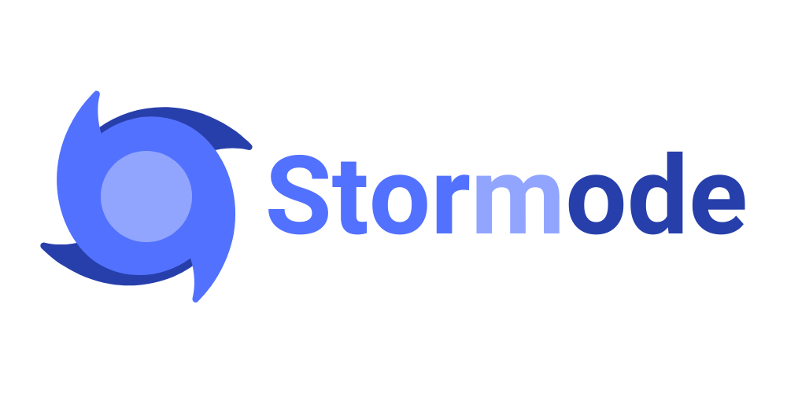

# Stormode

Stormode, a build tool for Node that offers a range of features to streamline your development process.

## Why Choose Stormode?

-   TypeScript & Path Aliases support: Write your code in TypeScript and enjoy the convenience of path aliases for cleaner imports.

-   esbuild bundler: Benefit from the lightning-fast esbuild bundler, ensuring quick and efficient builds.

-   Env support: Seamlessly manage environment variables with Stormode, making your project adaptable to different configurations.

## Getting Started with Stormode

You can use the following commands to begin your journey:

```bash
# npm
npx create-stormode
npm create stormode # atlernative way

# pnpm
pnpm create stormode
```

After project created successfully, you can access into your project to install dependencies and run it.

```bash
# npm
npm install
npm run dev

# pnpm
pnpm install
pnpm run dev
```

## Manual Installation

If you prefer a more hands-on installation process, you can follow the step below.

First of all, install the `stormode` dependency:

```bash
# npm
npm install -D stormode

# pnpm
pnpm add -D stormode
```

If you are using TypeScript, make sure to install the necessary dependencies as well:

```bash
# npm
npm install -D typescript ts-node @types/node

# pnpm
pnpm add -D typescript ts-node @types/node
```

After installing the dependencies, add the `tsconfig.json` to the root of your project.

Next, add the compiler options to `tsconfig.json`. You can follow the setup below or customize it according to your preferences:

```json
{
	"compilerOptions": {
		"strict": true,
		"alwaysStrict": true,
		"rootDir": "./src",
		"outDir": "./dist",
		"module": "commonjs",
		"target": "es5",
		"moduleResolution": "node",
		"esModuleInterop": true,
		"resolveJsonModule": true,
		"skipLibCheck": true,
		"baseUrl": ".",
		"paths": {
			"@/*": ["src/*"]
		}
	}
}
```

Stormode comes pre-installed with `tsconfig-paths/register`, so you only need to require it in the `tsconfig.json` to enable recognition of absolute paths.

```json
{
	"compilerOptions": {},
	"ts-node": {
		"require": ["tsconfig-paths/register"]
	}
}
```

After installing dependencies (and `tsconfig.json` configuration), you may add Stormode scripts into `package.json` to run you project.

```json
{
	"scripts": {
		"dev": "stormode dev",
		"build": "stormode build",
		"preview": "stormode preview"
	}
}
```

Then start your project in development mode with this command:

```bash
# npm
npm run dev

# pnpm
pnpm run dev
```

## Built-in Commands

Stormode comes with a variety of built-in commands to streamline your workflow.

### development server

Launch a development server that automatically restarts on file changes.

```bash
stormode dev
```

### build project

The build command performs several tasks to optimize your project for production:

-   Transpile TypeScript to JavaScript
-   Convert absolute paths to relative paths
-   Replace environment variables

```bash
stormode build
```

### production preview

Preview your production-ready server with this command.

```bash
stormode preview
```

## Command Parameters

You can further customize the commands using parameters.

### `--config` / `-c`

Specify a custom config file for Stormode.

```bash
stormode build --config anyname.js
```

## ESModule & CommonJS

Most TypeScript templates use ESModule by default, and are subsequently transferred to CommonJS during transpilation. However, JavaScript templates employ CommonJS as the default, leading to an error `cannot use import statement outside a module` when attempting to use `import xx from xx` and `export default xx`. To resolve this error, you can add the following property to `package.json`:

```json
{
	"type": "module"
}
```

## About .env

To manage various environment variables, you can create multiple .env files, with their priorities determining the order as follows:

-   on `dev`:

    `.env.development.local` > `.env.development` > `.env.local` > `.env`

-   on `build`:

    `.env.production.local` > `.env.production` > `.env.local` > `.env`

Create an env file and add variables:

```conf
WORD="Hello World!"
```

Then use it in the development code like this:

```typescript
const word: string = process.env.WORD;
```

## Create Your Stormode Configuration

You may configure Stormode by creating a file named `stormode.config.js`. Here's an example:

```javascript
const config = {
	app: {
		// watch src folder by default
		watch: [],
		// ignore folder, file
		ignore: [],
	},
	dev: {
		// source folder
		src: "src",
		// index file
		index: "index.ts",
	},
	build: {
		// dist folder
		dist: "dist",
		// enable bundling
		bundle: false,
		// minify code
		minify: false,
		// add sourcemap
		sourcemap: false,
		// add esbuild plugins
		plugins: [],
	},
};

module.exports = config;
```

Or `stormode.config.ts` if you are using TypeScript and ESModule:

```typescript
import { Config } from "stormode";

const config = {
	// ...
} as Config;

export default config;
```

## License

This project is MIT licensed, you can find the license file [here](./LICENSE).
