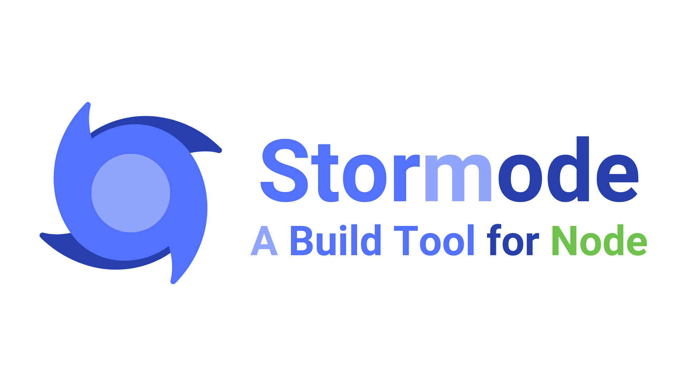

# Stormode

Stormode, a build tool for Node that offers a range of features to simplify your development process.

-   Simplify Setup
-   Colorful Terminal
-   TypeScript Support
-   Environment Variables
-   Fast Transpiling & Bundling

## Getting Started with Stormode

You can use the following commands to begin your journey:

```bash
# npm
npm create stormode

# pnpm
pnpm create stormode
```

After project created successfully, you can access into your project to install dependencies and run it.

```bash
# npm
npm install
npm run dev

# pnpm
pnpm install
pnpm run dev
```

For manual installation, visit [docs/manual-installation.md](./docs/manual-installation.md).

## Commands

Stormode comes with a variety of built-in commands to streamline your workflow. You can access these commands by running `stormode <command>`.

| Command   | Description                   |
| :-------- | :---------------------------- |
| `dev`     | Start the development server. |
| `build`   | Build your project.           |
| `preview` | Start the preview server.     |

For more information, visit [docs/commands.md](./docs/commands.md).

## Environment Variables

To manage various environment variables, you can create multiple .env files, with their priorities determining the order as follows:

-   on `dev`:

    `.env.development.local` > `.env.development` > `.env.local` > `.env`

-   on `build`:

    `.env.{env}.local` > `.env.{env}` > `.env.local` > `.env`

Create an env file and add variables:

```javascript
WORD = "Hello World!";
```

Then use it in the project like this:

```javascript
const word = process.env.WORD;
```

## Configuration

Visit [docs/configuration.md](./docs/configuration.md) for more information.

## Troubleshooting

Visit [docs/troubleshooting.md](./docs/troubleshooting.md) for more information.

## License

This project is MIT licensed, you can find the license file [here](./LICENSE).
